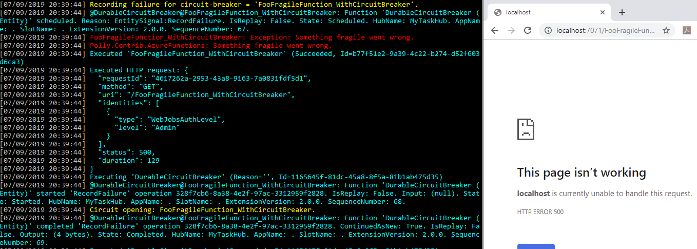

# Polly.Contrib.AzureFunctions.CircuitBreaker

This repo provides a **durable, distributed circuit-breaker**, implemented in Azure Entity Functions.

## Where can the Durable, Distributed Circuit-Breaker be consumed from?

The durable, distributed circuit-breaker can be consumed:

+ **within an Azure functions app** - by plain Azure functions or by orchestration functions; 
+ **from anywhere, over an https api**.

## How is the Durable Circuit-Breaker implemented?

The implementation uses [Durable Entity functions](https://docs.microsoft.com/en-us/azure/azure-functions/durable/durable-functions-entities) to persist circuit state durably across invocations and across scaled-out function apps.

_Durable Entity Functions went GA in early November 2019.  This implementation was written at the time of the preview, and does not yet utilize some innovations made between preview and general availability. Some details of the implementation here can simplify (see readme and codebase), without affecting the overall durable circuit-breaker concept and behaviour._

## What is the Durable Circuit-Breaker's behaviour?

The breaker behaves as a consecutive-count circuit-breaker, as described for the [original Polly circuit-breaker](https://github.com/App-vNext/Polly/wiki/Circuit-Breaker):

+ In **Closed** state, the circuit-breaker permits executions and counts consecutive failures.
  - If a configuration threshold `MaxConsecutiveFailures` is met, the circuit transitions to **Open** for a duration of `BreakDuration`.
+ In **Open** state: executions are blocked, and fail fast.
+ After `BreakDuration` in open state, the circuit transitions to **half-open** state.
+ In **Half-open** state, test-executions are permitted:
  - if the first test execution to report its outcome succeeds, the circuit _closes_ again
  - if the first test execution to report its outcome fails, the circuit _opens_ again.

For more detail, see the [original Polly circuit-breaker wiki](https://github.com/App-vNext/Polly/wiki/Circuit-Breaker).

For those familiar with the existing Polly circuit-breaker, the durable circuit-breaker implementation differs in permitting multiple execution attempts in half-open state in some cases (see later).

### Does the implementation provide a single or multiple instances?

The implementation manages multiple circuit-breaker instances. Each instance is identified by a unique `circuitBreakerId`.  

## How to use a circuit-breaker from within an Azure function

The code provides an interface `IDurableCircuitBreakerClient` defining five asychronous operations on a circuit-breaker:

    public interface IDurableCircuitBreakerClient
    {
        Task<bool> IsExecutionPermitted(string circuitBreakerId, ...);
        Task RecordSuccess(string circuitBreakerId, ...);
        Task RecordFailure(string circuitBreakerId, ...);
        Task<CircuitState> GetCircuitState(string circuitBreakerId, ...);
        Task<BreakerState> GetBreakerState(string circuitBreakerId, ...);
    }

Take an instance of `IDurableCircuitBreakerClient circuitBreakerClient` by dependency-injection into your function.

The interface methods exist in forms taking an `IDurableOrchestrationClient` (for use in plain Azure functions), and in forms taking an `IDurableOrchestrationContext` (for use in Azure Orchestrator functions).

### How to call the circuit-breaker to protect an operation which may fail

A standard pattern is as below. See `FooFragileFunction_WithCircuitBreaker` in the solution for an example.

    if (!(await circuitBreakerClient.IsExecutionPermitted(CircuitBreakerId, log, orchestrationClient)))
    {
        return new StatusCodeResult((int)HttpStatusCode.ServiceUnavailable); // Or however else you wish to communicate an execution blocked by an open circuit.
    }

    try
    {
        var result = await DoFragileWork(...);

        await circuitBreakerClient.RecordSuccess(CircuitBreakerId, log, orchestrationClient);

        return result;
    }
    catch
    {
        await circuitBreakerClient.RecordFailure(CircuitBreakerId, log, orchestrationClient);

        return new InternalServerErrorResult(); // Or however else you communicate failure outwards
    }

Of course, you can extend this pattern to filter on specific exceptions; or treat certain returned result values also as failures.

### Demo: Using the circuit-breaker in an Azure function

+ Start the functions app locally [using the Azure Functions Core Tools local development experience](https://docs.microsoft.com/en-us/azure/azure-functions/functions-develop-local), or deploy to your Azure subscription and set environment variables similar to the choices in `local.settings.json`.
+ Hit the endpoint configured in your function app for `FooFragileFunction_WithCircuitBreaker`, repeatedly.
  - The endpoint simulates an operation failing 50% of the time.
  - The sample is configured to break the circuit for 10 seconds when 2 consecutive failures have occurred.

_Hint:_ You can see the operation of the circuit-breaker in the logging. (The example below shows output from the local development experience; default log-levels have been chosen to highlight circuit-breaker logging, for easy demo.)

### Performance

In trials in Azure UK regions, the cost of adding a durable circuit breaker to an existing Azure function approximated 3-5ms.

#### Additional optimisations for high throughput

An additional optimisation allows the state of the circuit-breaker to be memory-cached for configured intervals, to avoid repeated reads of state that is unlikely to have changed.  In healthy system running, circuit state may not change frequently, and caching can be a strong optimisation when high numbers of requests per second might otherwise invoke many unnecessary entity reads.  

A configuration value `PerformancePriorityCheckCircuitInterval` defines how long the circuit state can be cached for - effectively, how often the true underlying circuit state will be checked.

In trials, using this parameter reduced the average additional latency of a durable circuit breaker on an existing Azure function, to ~1-3ms.

## Azure Entity Function deep-dive: How does the behaviour differ between plain Azure functions and Azure Orchestrator functions?

The underlying implementation of Azure Entity Functions has some differences between plain Azure functions and Orchestrator functions. The APIs on **plain** functions [prioritise performance over consistency](https://docs.microsoft.com/en-us/azure/azure-functions/durable/durable-functions-preview#accessing-entities-from-clients); **orchestrator** functions feature APIs offering [stronger consistency guarantees](https://docs.microsoft.com/en-us/azure/azure-functions/durable/durable-functions-preview#accessing-entities-from-orchestrations).

The Distributed Circuit-Breaker implementations reflect this.

The circuit-breaker **orchestrator** functions API offer stronger consistency guarantees: 
  - The state of the circuit is intended to always reflect any preceding success/fail execution outcomes which have been recorded against it.
  - The **half-open** state only allows one trial execution per circuit `BreakDuration`. 

This provides behaviour matching the classic circuit-breaker pattern described in the [original Polly circuit-breaker wiki](https://github.com/App-vNext/Polly/wiki/Circuit-Breaker).

For the circuit-breaker **plain** Azure functions API, the behaviour changes in the following ways, to prioritize performance:

- There is a weaker guarantee in half-open state. The half-open state permits multiple test executions (if requests arrive concurrently) until the first result is received. The first success or failure recorded in half-open state will cause the circuit to transition from half-open to closed or open again.
- It is theoretically possible for the circuit-state to be fractionally stale if requests to record preceding success/fail executions have not executed against the entity by the time another execution reads circuit state.  This fractional staleness (aka weaker consistency guarantee) is not considered significant for the circuit-breaker use case, which is in any case an approximation over the health of the underlying system, in comparison to the performance gain.

#### What is the method `IsExecutionPermitted_StrongConsistency()` found on `IDurableCircuitBreakerClient`?

The method `IsExecutionPermitted_StrongConsistency()` offers the possibility of a strongly-consistent IsExecutionPermitted API for _plain_ Azure functions, by invoking an orchestrator function specifically for this purpose.  In trials in UK Azure regions, the cost of this (life-cycling an orchestration just for this purpose) was found to vary between 40-140 ms.  If you are already operating in Durable Orchestrator functions, you do _not_ pay this additional cost as the APIs once within the Orchestrator are fast.

## How to consume as a durable, distributed circuit-breaker from any location, over https

The example durable circuit-breaker code exposes an http/s api for consuming the circuit-breaker.  By default, the operations are exposed on the below endpoints:

_Note: The Microsoft Functions team innovated on the durable functions entities preview and the GA now provides [direct access methods for entities](https://docs.microsoft.com/en-us/azure/azure-functions/durable/durable-functions-dotnet-entities#accessing-entities-directly). The implementation here can be updated to these new patterns; but the concept of addressing the circuit-breaker entity over endpoints such as below will remain the same._

| Endpoint | Http verb | Operation | Example return value |
| --- | --- | --- | --- | 
| `/DurableCircuitBreaker/{circuitBreakerId:alpha}/IsExecutionPermitted` | POST1 | Returns whether an execution is permitted | 200 OK `true` |
| `/DurableCircuitBreaker/{circuitBreakerId:alpha}/RecordSuccess` | POST1 | Records a success outcome in the breaker's internal statistics | 200 OK |
| `/DurableCircuitBreaker/{circuitBreakerId:alpha}/RecordFailure` | POST1 | Records a failure outcome in the breaker's internal statistics | 200 OK  |
| `/DurableCircuitBreaker/{circuitBreakerId:alpha}/GetCircuitState` | GET | Returns the state of the circuit | 200 OK `Closed` |
| `/DurableCircuitBreaker/{circuitBreakerId:alpha}/GetBreakerState` | GET | Returns the full state of the circuit-breaker, including circuit-state and when the circuit is broken until | 200 OK  `{ "brokenUntil": "0001-01-01T00:00:00", "circuitState":"Closed", "consecutiveFailureCount":0, "maxConsecutiveFailures":3, "breakDuration":"00:00:05" }` |

1 Operations described as POST (including IsExecutionPermitted) are POST because they modify the circuit's internal statistics or state.  For the sake of easy demoing, the sample application exposes these endpoints also as GET.

To consume this circuit-breaker from an external application, make calls to the endpoints `/IsExecutionPermitted`, `/RecordSuccess` and `/RecordFailure` from your client code. You would typically implement a pattern similar to the below.  

_(example intentionally in pseudo-code, not C#, as you may consume the distributed circuit-breaker from any language)_

    string circuitBreakerId = ... // circuit breaker to use

    if (calling /{circuitBreakerId}/IsExecutionPermitted returns false)
    {
        throw Exception("Circuit is broken.") // or choose some other way to indicate a broken circuit to your code
    }

    try
    {
        var result = /* execute the code you want guarded by the breaker */

        call /{circuitBreakerId}/RecordSuccess // can be fire-and-forget
    }
    catch exception
    {
        call /{circuitBreakerId}/RecordFailure // can be fire-and-forget

        rethrow exception
    }

In .NET Core, the most obvious way to implement this would be to use HttpClientFactory to define an `HttpClient` with BaseUri and authorization pre-configured for placing the calls to the distributed circuit-breaker functions.

The `GetCircuitState` and `GetBreakerState` endpoints are provided for information and are not required to be used to operate the circuit-breaker.

### Demo: Consuming as a distributed circuit-breaker over http

+ Start the functions app locally [using the Azure Functions Core Tools local development experience](https://docs.microsoft.com/en-us/azure/azure-functions/functions-develop-local) or deploy to your Azure subscription with appropriate environment variables set.
+ The circuit-breaker with `circuitBreakerId: MyCircuitBreaker` is configured to break for five seconds if 3 consecutive failures occur.
+ Prepare the following endpoints as calls you can repeatedly make - eg with Postman, Curl, or simply open each as a separate tab in a local browser:  (as mentioned above, strictly RESTful semantics would have three of these POST-only, but the sample exposes all as GET for quick exploration/demo via a browser)
  - `https://<yourfunctionhost>/DurableCircuitBreaker/MyCircuitBreaker/GetCircuitState`
  - `https://<yourfunctionhost>/DurableCircuitBreaker/MyCircuitBreaker/GetBreakertate`
  - `https://<yourfunctionhost>/DurableCircuitBreaker/MyCircuitBreaker/IsExecutionPermitted`
  - `https://<yourfunctionhost>/DurableCircuitBreaker/MyCircuitBreaker/RecordSuccess`
  - `https://<yourfunctionhost>/DurableCircuitBreaker/MyCircuitBreaker/RecordFailure`

+ You can then call the endpoints in turn to exercise the circuit-breaker. For example:

  - `GetCircuitState` should initially return `Closed`
  - `IsExecutionPermitted` should initially return `true`
  - Interleave calling `RecordSuccess` and `RecordFailure` without yet three failures in a row - between these calls, `GetCircuitState` and `IsExecutionPermitted` should still return `Closed` and `true`
  - Call `RecordFailure` three times in a row. 
    - `GetCircuitState` should then return `open`
    - Within the following 5 seconds, `IsExecutionPermitted` should return `false`

+ and so on ... see the [original Polly circuit-breaker wiki](https://github.com/App-vNext/Polly/wiki/Circuit-Breaker) for full info on how the circuit-breaker cycles through states.

### What is the implementation and the performance of the https API version?

The https API is implemented using the performance-priority plain Azure functions mode described above.

## How is a circuit-breaker instance configured?

Each circuit-breaker instance consumed is configured in the function app's app settings.

All configuration values are of the form: 

    "CircuitBreakerSettings:<circuitBreakerId>:<settingName>": <value>

### Mandatory settings per `circuitBreakerId`

| Setting name | Type | Meaning | Example |
| --- | --- | --- | --- | 
| `MaxConsecutiveFailures` | int |  The number of consecutive failures at which the circuit will break. | 2 |
| `BreakDuration` | ISO 8601 duration |  The duration for which to break the circuit. |`PT30S` (30&nbsp;seconds)|

### Optional settings, per `circuitBreakerId`

| Setting name | Type | Meaning | Default  (if not specified) |
| --- | --- | --- | --- |
| `LogLevel` | `Microsoft .Extensions .Logging .LogLevel` | The level at which to log circuit events. | `LogLevel .Information` |
| `ConsistencyPriorityCheckCircuitTimeout` | ISO 8601 duration | In consistency mode, the maximum duration to wait to determine whether an execution should be permitted. (If the circuit state cannot be determined within this timespan, the execution is permitted.) |`PT2S`|
| `ConsistencyPriorityCheckCircuitRetryInterval` | ISO 8601 duration | In consistency mode, an internal setting determining how often to retry obtaining state (within the above timeout), if it is delayed. |`PT0.25S`|
| `PerformancePriorityCheckCircuitInterval` | ISO 8601 duration | In priority mode, the state will be memory-cached and not requeried for this period, to prioritise performance. |`PT2S`|

### What about scoping named circuit-breaker instances? Can the same circuit-breaker instance be used across multiple calls?

Operations consuming `DurableCircuitBreaker` specify a `circuitBreakerId` which identifies a unique circuit-breaker instance maintaining its own state.

Multiple code locations in an azure functions app and/or external https consumers can execute through the same-named `circuitBreakerId`:

+ Use the same-named circuit-breaker instance across call sites or functions when you want those call sites to share circuit state and break in common - for example they share a common downstream dependency. 
+ Use independent-named circuit-breakers when you want call sites to have independent circuit state and break independently.

### What about logging?

For the purposes of visibility while demoing, the demo code intentionally centralises circuit-breaker logging through `LoggerExtensions.LogCircuitBreakerMessage(...)`. The `LogLevel` visibility of these messages can be set using the config setting `CircuitBreakerSettings:<circuitBreakerId>:LogLevel`. 

In a production app you might choose to organise your logging differently.

## Implementation details

### Components

| File | Kind | Role |
| --- | --- | --- |
|`DurableCircuitBreakerEntity`|durable entity function|contains the core circuit-breaker logic. Defines and implements five operations: + `IsExecutionPermitted` + `RecordSuccess` + `RecordFailure`  + `GetCircuitState`  + `GetBreakerState`|
|`I/DurableCircuitBreakerClient`|interfaces to Azure functions tooling|Defines methods for querying and invoking actions on the circuit entity|
|`DurableCircuitBreakerExternalApi`|http-triggered functions|an external API for consuming the durable circuit-breaker from anywhere, over http|
|`local.settings.json`|configuration environment variables|demonstrates configuration for circuit-breaker instances|
|`FooFragileFunction_*`|Standard http-triggered function|demonstrates a standard Azure function executing its work through the circuit-breaker|

### Characteristics

The implementation intentionally makes lightweight use of Entity Functions features, using a single Entity Function to maintain state and a low number of calls and signals to or between entities.  

## Status and future changes

At time of writing, the Durable Distributed Circuit Breaker is provided as a proof-of-concept, starter pattern for users to trial for adaptation into their own Azure functions apps.

The Microsoft Functions team is continuously innovating on the Durable Functions Entities preview and we can expect some items of this code to simplify (notes are within the code) as Durable Functions Entities come towards GA.  However, these are mostly entities API changes under the hood - from the perspective of the distributed circuit-breaker, the concepts can be expected to remain the same and be stable.

## Credits

Polly.Contrib.AzureFunctions.CircuitBreaker was built by [@reisenberger](https://github.com/reisenberger).

## License

Polly.Contrib.AzureFunctions.CircuitBreaker is licensed under the [BSD 3-clause license](https://github.com/Polly-Contrib/Polly.Contrib.AzureFunctions.CircuitBreaker/blob/master/LICENSE).

## Comparable projects

Jeff Hollan (Principal PM Mgr for Microsoft Azure Functions) has also released https://github.com/jeffhollan/functions-durable-actor-circuitbreaker, which demonstrates another variant on the circuit-breaker pattern in Azure Functions.  

The project differs from the one here in that:

+ it records failures over a time window
+ when the circuit breaks, it is pre-coded to fire an event which will disable a Function App.

This concept can be useful if the function app being governed hosts a queue-triggered function. With a function processing queue messages, when some downstream component required for processing is unavailable (indicated by the circuit-breaking), you want to avoid receiving messages into the function at all - to avoid receiving messages and having to reject them, leading eventually to dead-lettered messages.  

The pattern would need to be augmented by a further process (for example a separate timer-triggered function or time-delaying orchestrator function) which re-closes the circuit (permits executions) after a given period of time.  For further discussion of these issues, [see here](https://github.com/App-vNext/Polly/issues/287#issuecomment-527767742).

A similar pattern (placing a call to disable a function app) could be adapted onto Polly.Contrib.AzureFunctions.CircuitBreaker, by extending the [code which breaks the circuit, here](https://github.com/Polly-Contrib/Polly.Contrib.AzureFunctions.CircuitBreaker/blob/5770a0c628041707cfd946fa9b367c814f4aadd6/Polly.Contrib.AzureFunctions/CircuitBreaker/DurableCircuitBreakerEntity.cs#L128-L136).
